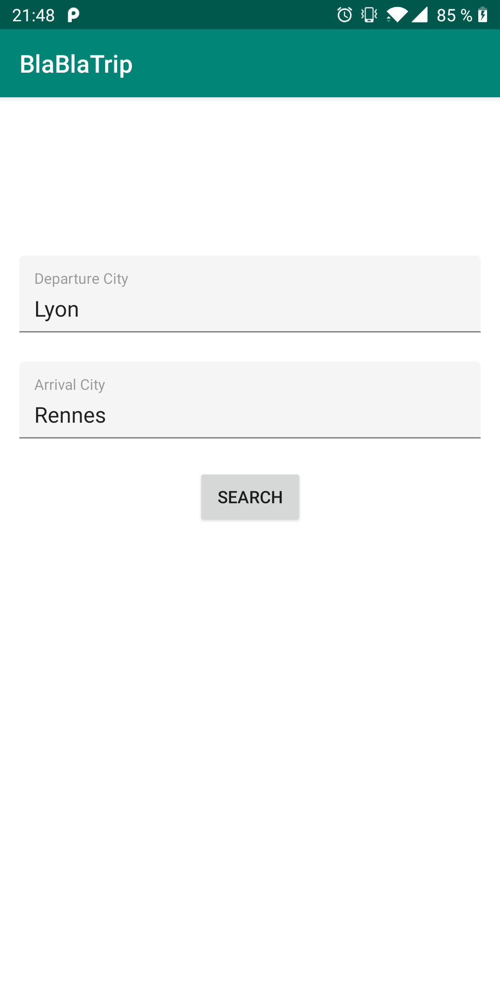
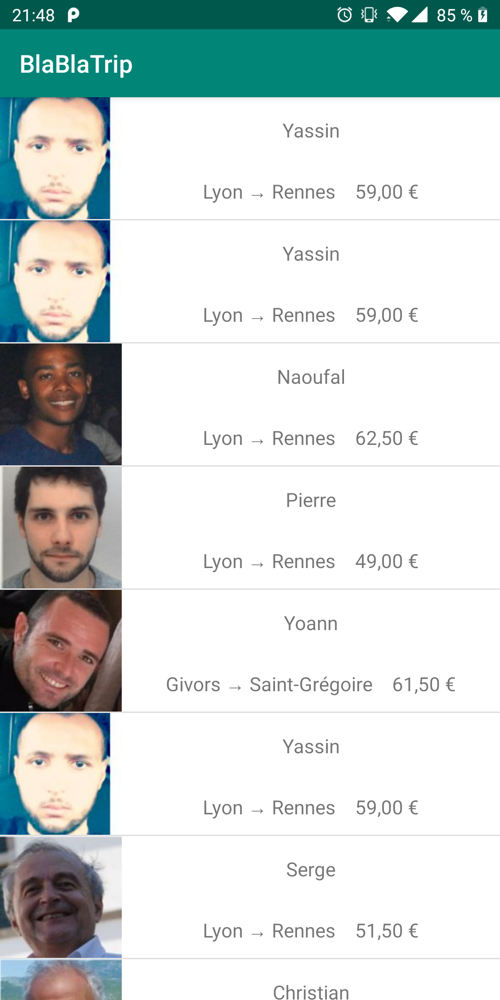

# BlaBlaCar technical test

This project is a technical test for a Senior Android position at BlaBlaCar

## Test Description

Implement a basic trip search with the help of BlaBlaCar’s API inside your new project. The goal
is to let the user select a departure and arrival cities and display the trip results returned by the
API.

The app will contains two screens, the first one will handle the search and the second will display a list of available.

## Constraint

The API is using OAuth2, it means that you have to be authenticated to request a list of trip, to do so you have to request a 
specific url with a `client secret` and a `client id`, then add the token received into the header of all other request.

## Realisation
The application is made in Kotlin using several librairies (RxJava2, Dagger2, Architecture Component, Retrofit, OkHttp, Jackson,
Mockito). There's also several unit tests.

I'm using MVVM architecture according to the SOLID principles.

Search Trip Screen         |  Result Search Screen
:-------------------------:|:-------------------------:
|

## Notes

You will not be able to build it, since I haven't provide the api keys but apk is available to download [here](https://github.com/MehdiChouag/blablacar_technical_test/raw/master/apk/app-debug.apk)
